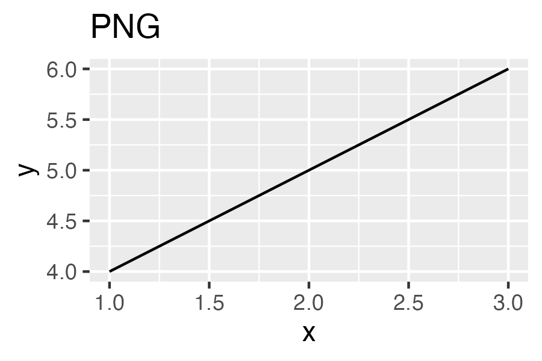

ggshow
======
[](https://badge.fury.io/py/ggshow)
[](https://github.com/kota7/ggshow/actions/workflows/python-package.yml)

Produce ggplot2 graphs from Python

## Install

```shell
# from pypi
pip install ggshow

# or from github
git clone --depth 1 https://github.com/kota7/ggshow.git
pip install -U ./ggshow
```

## Requirements

- Python 3.5+
- `Rscript` command and the R environment with `ggplot2` package installed

## Functionalities

- `ggshow`: Draw graphs using ggplot2 on R and return the Image object that you can show on Jupyter notebook. From v0.1.10, we can also save the image to the file.
- `ggwrite`: Draw graphs using ggplot2 on R and save it to a file (but not show on the notebook).
- `%gg`, `%%gg`: ipython magic for drawing ggplot2 graph.


```python
from ggshow import ggshow, ggwrite
```


```python
# Minimal example
# pass R code to produce ggplot graph to ggshow function
# note: ggplot2 is automatically imported
ggshow("""
  x <- c(1,2,3)
  y <- c(4,5,6)
  ggplot(mapping=aes(x, y)) + geom_line()
""", savesize=(3, 2))
None
```


    
    


```python
# Example with data frames
# pass pandas data frames as keyword arguments
# then you can use them in the R code
import numpy as np
import pandas as pd
x = np.linspace(-20, 20, 500)
y = np.sin(x)
y2 = 0.4*np.cos(x)

df1 = pd.DataFrame({"x":x, "y":y})
df2 = pd.DataFrame({"x":x, "y":y2})
ggshow("""
  ggplot(a, aes(x, y)) + 
    geom_line(color="blue") +
    geom_line(data=b, linetype="dashed", color="red") +
    theme_bw()
""", dispwidth=500, savesize=(4, 2), a=df1, b=df2)
None
```


    
    


```python
# Example to save the graph to a file
ggshow("""
  x <- c(1,2,3)
  y <- c(4,5,6)
  ggplot(mapping=aes(x, y)) + geom_line()
""", outfile="foo.jpg", savesize=(3, 2))
```


    
    


```python
# Example to "only" save the graph to a file, not to show
ggshow("""
  x <- c(1,2,3)
  y <- c(4,5,6)
  ggplot(mapping=aes(x, y)) + geom_line()
""", outfile="bar.jpg", savesize=(3, 2))

# Confirm the file has been created
from IPython.display import Image
Image("bar.jpg", width=400)
```


    


```python
# Example to specify the image file format
# But there may not be significant differences to human eyes
# Default: png
ggshow("""
  x <- c(1,2,3)
  y <- c(4,5,6)
  ggplot(mapping=aes(x, y)) + geom_line() + ggtitle("PNG")
""", savesize=(3, 2), imageformat="png")

ggshow("""
  x <- c(1,2,3)
  y <- c(4,5,6)
  ggplot(mapping=aes(x, y)) + geom_line() + ggtitle("JPEG")
""", savesize=(3, 2), imageformat="jpeg")

ggshow("""
  x <- c(1,2,3)
  y <- c(4,5,6)
  ggplot(mapping=aes(x, y)) + geom_line() + ggtitle("SVG")
""", savesize=(3, 2), imageformat="svg")
None
```


    

    


    

    


    

    


```python
# Example using %gg magic
%load_ext ggshow
```


```python
## line magic
%gg ggplot(mapping=aes(1, 2)) + geom_point() -s 4 3 --dispwidth 300 --outfile buz.jpeg
```


    


    


```python
## line magic with the code as a string variable
x = np.linspace(-20, 20, 500)
y = np.sin(x)
y2 = 0.4*np.cos(x)

df1 = pd.DataFrame({"x":x, "y":y})
df2 = pd.DataFrame({"x":x, "y":y2})
code = """
ggplot(a, aes(x, y)) + 
  geom_line(color="blue") +
  geom_line(data=b, linetype="dashed", color="red") +
  theme_bw() +
  ggtitle("Sine and Cosine Waves")
"""

%gg {code} -s 4 2 --dispwidth 400 --data a=df1 b=df2
```


    

    


```python
%%gg -s 4 2 --dispwidth 400 --data a=df1 b=df2

## cell magic
ggplot(a, aes(x, y)) + 
  geom_line(color="blue") +
  geom_line(data=b, linetype="dashed", color="red") +
  theme_bw() +
  ggtitle("Sine and Cosine Waves")
```


    


    


```python
# show the full command options
%gg --help
```

    Help on method gg in module ggshow.ggshow:
    
    gg(line, cell=None) method of ggshow.ggshow.GGMagic instance
        ::
    
          %gg [--help] [--outfile OUTFILE] [-s SAVESIZE SAVESIZE] [--scale SCALE]
                  [--units UNITS] [--dpi DPI] [--message_encoding MESSAGE_ENCODING]
                  [--rscriptcommand RSCRIPTCOMMAND] [-w DISPWIDTH] [-h DISPHEIGHT]
                  [--imageformat {png,jpeg,svg}] [--libs [LIBS ...]]
                  [--data [DATA ...]]
                  [plotcode ...]
    
        positional arguments:
          plotcode              R code
    
        options:
          --help
          --outfile OUTFILE     File path to save the graph
          -s <SAVESIZE SAVESIZE>, --savesize <SAVESIZE SAVESIZE>
                                height, width
          --scale SCALE         ggsave option scale
          --units UNITS         ggsave option units
          --dpi DPI             ggsave option dpi
          --message_encoding MESSAGE_ENCODING
                                Encoding of the subprocess outputs
          --rscriptcommand RSCRIPTCOMMAND
                                Rscript command name
          -w DISPWIDTH, --dispwidth DISPWIDTH
                                display width
          -h DISPHEIGHT, --dispheight DISPHEIGHT
                                display width
          --imageformat <{png,jpeg,svg}>
                                imagefile format
          --libs <[LIBS ...]>   R libraries to use
          --data <[DATA ...]>   data frames mapping as {name in r}={name in python}
    


```python
# By default, we use 'Rscript' as the command to run R code.
# If this is not a valid command on the environment,
# we can specify the command by `rscriptcommand` option 
ggshow("""
  x <- c(1,2,3)
  y <- c(4,5,6)
  ggplot(mapping=aes(x, y)) + geom_line()
""", savesize=(3, 2), rscriptcommand="/usr/local/bin/Rscript")


# Or set the new command path as the default using set_rscript function.
from ggshow import config, set_rscript

set_rscript("/usr/local/bin/Rscript")  
print(config.rscript)
# this is just the full path of the command on this environment
# so the command will work in the same way
```


    

    


    /usr/local/bin/Rscript
